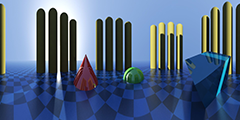
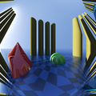
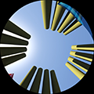
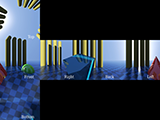
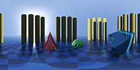
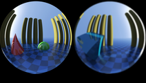
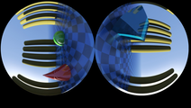
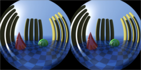
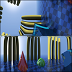

# Panoramic Geometry Collection #

**Version 4** Released 2019-10-20  
by Andrew Hazelden

## Overview ##

This is a collection of panoramic meshes that can be used to preview equirectangular, mirrorball, fulldome, cylindrical, and cubic panoramas. The meshes were created as part of the development process for the Domemaster3D shader's [DomeViewer Tool](https://code.google.com/p/domemaster-stereo-shader/wiki/DomeViewer).

If you need a tool to convert imagery between the different cubic formats you should try out my (free) [Domemaster Photoshop Actions Pack](http://www.andrewhazelden.com/blog/2012/11/domemaster-photoshop-actions-pack/), or for video clips you can explore my (free) [KartaVR for Resolve/Fusion](http://www.andrewhazelden.com/projects/kartavr/docs/) toolset.

The panoramic mesh files are released under a GPL v3 license and are available in Maya and OBJ formats:

## Available Meshes ##
The following files are included:

> - `angular360_mesh.ma`
> - `angular360_mesh.obj`
> - `cube3x2_mesh.ma`
> - `cube3x2_mesh.obj`
> - `cylinder_mesh.ma`
> - `cylinder_mesh.obj`
> - `facebookCube3x2_mesh.ma`
> - `facebookCube3x2_mesh.obj`
> - `facebookPyramid_mesh.ma`
> - `facebookPyramid_mesh.obj`
> - `facebookVerticalStripCube_mesh.ma`
> - `facebookVerticalStripCube_mesh.obj`
> - `fulldome_mesh_smoothed.ma`
> - `fulldome_mesh_smoothed.obj`
> - `fulldome_mesh.ma`
> - `fulldome_mesh.obj`
> - `fulldome_quads_4_3_mesh.ma`
> - `fulldome_quads_16_9_mesh.ma`
> - `fulldome_quads_mesh.ma`
> - `fulldomeGrid_mesh.ma`
> - `fulldomeGrid_mesh.obj`
> - `gearVRCube_mesh.ma`
> - `gearVRCube_mesh.obj`
> - `horizontalCrossCube_mesh.ma`
> - `horizontalCrossCube_mesh.obj`
> - `horizontalStripCube_mesh.ma`
> - `horizontalStripCube_mesh.obj`
> - `horizontalTeeCube_mesh.ma`
> - `horizontalTeeCube_mesh.obj`
> - `latlongSphere_mesh.ma`
> - `latlongSphere_mesh.obj`
> - `lg360_mesh.ma`
> - `lg360_mesh.obj`
> - `mentalRayCube1_mesh.ma`
> - `mentalRayCube1_mesh.obj`
> - `mirrorball_mesh.ma`
> - `mirrorball_mesh.obj`
> - `ricoh_theta_s_mesh.ma`
> - `ricoh_theta_s_mesh.obj`
> - `samsungGear360_mesh.ma`
> - `samsungGear360_mesh.obj`
> - `starglobe_mesh.ma`
> - `starglobe_mesh.obj`
> - `verticalCrossCube_mesh.ma`
> - `verticalCrossCube_mesh.obj`
> - `verticalStripCube_mesh.ma`
> - `verticalStripCube_mesh.obj`
> - `verticalTeeCube_mesh.ma`
> - `verticalTeeCube_mesh.obj`
> - `youtube_cubemap3x2_mesh.obj`

                     

## Image Projections ##

**Angular Fisheye 360 Degree**  

This image projection shows a fullframe 360° fisheye image that is also known as an HDRI lightprobe.

----------

**Blender Cubemap 3x2**  

The Blender Cubemap 3x2 faces are located in the format:
<table>
  <tr>
    <td>left</td> <td>back</td> <td>right</td>
  </tr>
  <tr>
    <td>bottom</td> <td>top</td> <td>front</td>
  </tr>
</table>

----------

**Cubemap 3x2**  

The Cubemap 3x2 faces are located in the format:
<table>
  <tr>
    <td>front</td> <td>right</td> <td>back</td>
  </tr>
  <tr>
    <td>left</td> <td>top</td> <td>bottom</td>
  </tr>
</table>

----------

**Cylinder**  

This image projection shows a cylindrically formatted image.

----------

**Facebook Cubemap 3x2**  

The Facebook Cubemap 3x2 faces are located in the format:

<table>
  <tr>
    <td>right</td> <td>left</td> <td>top</td>
  </tr>
  <tr>
    <td>bottom</td> <td>front</td> <td>back</td>
  </tr>
</table>

----------

**Facebook Pyramid**  

This image projection fits an unfolded 4 sided polygon pyramid into the full surface area of a square 0-1 UV space. The front view of the panoramic image fills the base region of the pyramid.

----------

**Facebook Vertical Strip**  

The Facebook vertical strip faces are all flipped horizontally and located in the format:

<table>
  <tr>
    <td>right</td>
  </tr>
  <tr>
    <td>left</td>
  </tr>
  <tr>
    <td>top (Rotated 180&deg;)</td>
  </tr>
  <tr>
    <td>bottom (Rotated 180&deg;)</td>
  </tr>
  <tr>
    <td>back</td>
  </tr>
  <tr>
    <td>front</td>
  </tr>
</table>

----------

**Fulldome Angular Fisheye 180 Degree**  

This image projection shows a fullframe 180° fisheye image that is also known as a domemaster image.

----------

**Gear VR**  

This image projection shows a Gear VR mono cubic image that is a special variation on the horizontal strip format.

The Gear VR mono cubic faces are located in the format:

<table>
  <tr>
   <td>Left</td> <td>Right</td> <td>Top (Rotated 180&deg;)</td> <td>Bottom (Rotated 180&deg;)</td> <td>Back</td> <td>Front</td>
  </tr>
</table>

A Gear VR stereo document is the same Gear VR cubic format just with an "SBS" side by side stereo frame arrangement. In a Gear VR stereo image the right view is placed first, followed by the left view.

The Gear VR stereo cubic faces are located in the format:

<table>
  <tr>
   <td>R-Left</td> <td>R-Right</td> <td>R-Top (Rotated 180&deg;)</td> <td>R-Bottom (Rotated 180&deg;)</td> <td>R-Back</td> <td>R-Front</td> <td>L-Left</td> <td>L-Right</td> <td>L-Top (Rotated 180&deg;)</td> <td>L-Bottom (Rotated 180&deg;)</td> <td>L-Back</td> <td>L-Front</td>
  </tr>
</table>

----------

**Horizontal Cross Cubemap**  

The horizontal cross faces are located in the format:

<table>
  <tr>
    <td>blank</td> <td>top</td> <td>blank</td> <td>blank</td>
  </tr>
  <tr>
    <td>left</td> <td>front</td> <td>right</td> <td>back</td>
  </tr>
  <tr>
    <td>blank</td> <td>bottom</td> <td>blank</td> <td>blank</td>
  </tr>
</table>

----------

**Horizontal Strip Cubemap**  

The horizontal strip faces are located in the format:

<table>
  <tr>
    <td>front</td> <td>right</td> <td>back</td> <td>left</td> <td>top</td> <td>bottom</td>
  </tr>
</table>

----------

**Horizontal Tee Cubemap**  

The horizontal tee faces are located in the format:

<table>
  <tr>
     <td>top</td> <td>blank</td> <td>blank</td> <td>blank</td>
  </tr>
  <tr>
    <td>front</td> <td>right</td> <td>back</td> <td>left</td>
  </tr>
  <tr>
    <td>bottom</td> <td>blank</td> <td>blank</td> <td>blank</td>
  </tr>
</table>

----------

**Equirectangular, Latitude/Longitude,  Spherical**  

This image projection shows a 2:1 aspect ratio 360° x 180° spherical panorama.

----------

**LG360 Camera**

The LG360 Camera camera has two fisheye lenses (facing forwards and backwards) that film a scene in panoramic 360&deg; live action video.

The camera saves the raw unstitched video in a side by side face arrangement at 30 frame per second.

----------

**Mental Ray Cube 1**  

The image projection shows a the mental ray `mib_lookup_cube1` horizontal strip image format.

The faces are located in the format:

<table>
  <tr>
    <td>left</td>
  </tr>
  <tr>
    <td>right</td>
  </tr>
  <tr>
    <td>bottom</td>
  </tr>
  <tr>
    <td>top (flipped vertically)</td>
  </tr>
  <tr>
    <td>back</td>
  </tr>
  <tr>
    <td>front</td>
  </tr>
</table>

----------

**Mirrorball**  

A mirrorball or ball map image is what you get when you photograph a chrome sphere. This image projection is common in the visual effects industry when a quick set lighting reference and environment map is needed.

----------

**Ricoh Theta S Camera**

The Ricoh Theta S camera has two fisheye lenses (facing forwards and backwards) that film a scene in panoramic 360&deg; live action video.

The camera saves the raw unstitched video in a side by side face arrangement to a 1920x1080 pixel sized video format at 30 frame per second.

----------

**Samsung Gear 360 Camera**

The Samsung Gear 360 camera has two fisheye lenses (facing forwards and backwards) that film a scene in panoramic 360&deg; live action video.

The camera saves the raw unstitched video in a side by side face arrangement at 30 frame per second.

----------

**Starglobe / Quadsphere**  

The Starglobe / quadsphere format is a custom polygon sphere that avoids the issues of pinched polar regions by using an all quad polygon topology. This is the same type of geometry that is used as the Mudbox primitive sphere shape.

----------

**Vertical Cross Cubemap**  

The vertical cross faces are located in the format:

<table>
  <tr>
    <td>blank</td> <td>top</td> <td>blank</td>
  </tr>
  <tr>
    <td>left</td> <td>front</td> <td>right</td>
  </tr>
  <tr>
    <td>blank</td> <td>bottom</td> <td>blank</td>
  </tr>
  <tr>
    <td>blank</td> <td>back (rotated 180&deg;)</td> <td>blank</td>
  </tr>
</table>

----------

**Vertical Strip Cubemap**  

The vertical strip faces are located in the format:

<table>
  <tr>
    <td>front</td>
  </tr>
  <tr>
    <td>right</td>
  </tr>
  <tr>
    <td>back</td>
  </tr>
  <tr>
    <td>left</td>
  </tr>
  <tr>
    <td>top</td>
  </tr>
  <tr>
    <td>bottom</td>
  </tr>
</table>

----------

**Vertical Tee Cubemap**  

The vertical tee faces are located in the format:

<table>
  <tr>
    <td>left</td> <td>front</td> <td>right</td>
  </tr>
  <tr>
     <td>blank</td> <td>bottom</td><td>blank</td>
  </tr>
  <tr>
     <td>blank</td> <td>back (rotated 180&deg;)</td> <td>blank</td>
  </tr>
  <tr>
     <td>blank</td> <td>top</td> <td>blank</td>
  </tr>
</table>

**YouTube Cubemap 3x2**  

The YouTube Cubemap 3x2 faces are located in the format:
<table>
  <tr>
    <td>left</td> <td>front</td> <td>right</td>
  </tr>
  <tr>
    <td>bottom (rotated 270&deg;)</td> <td>back (rotated 90&deg;)</td> <td>top (rotated 270&deg;)</td>
  </tr>
</table>

----------

## Closing Notes ##

I hope you find these mesh files useful for your VR/Pano/Fulldome projects. If you have any questions, feel free to contact me via email or twitter.

Cheers,  
Andrew Hazelden

Email: [andrew@andrewhazelden.com](mailto:andrew@andrewhazelden.com)   
Blog: [http://www.andrewhazelden.com](http://www.andrewhazelden.com)  
